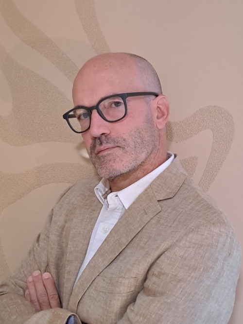
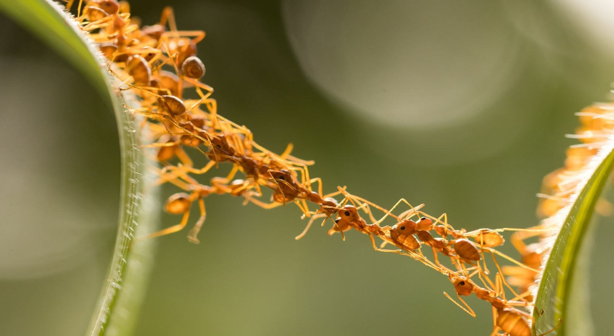
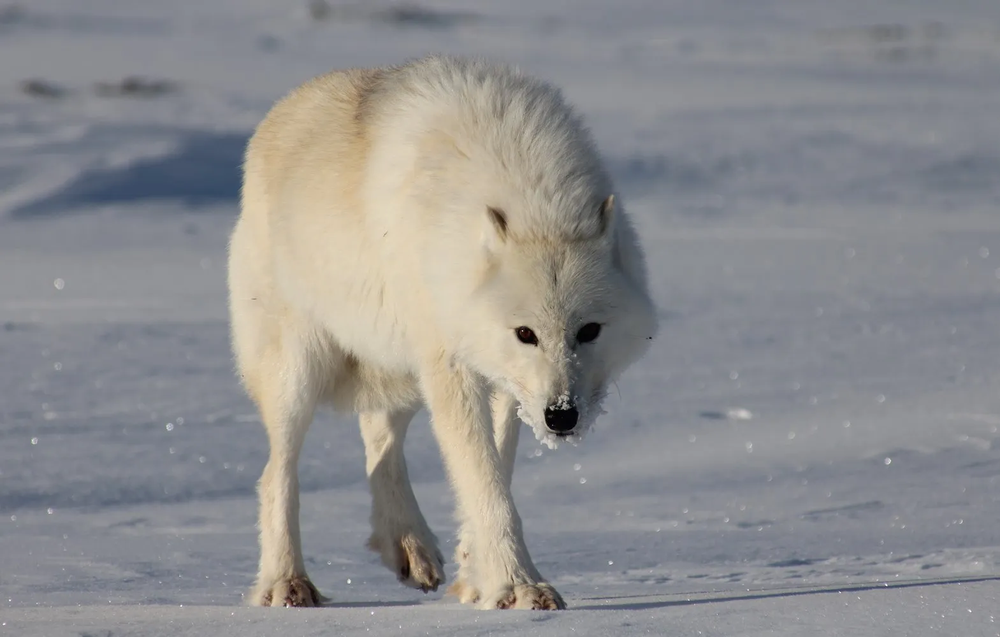
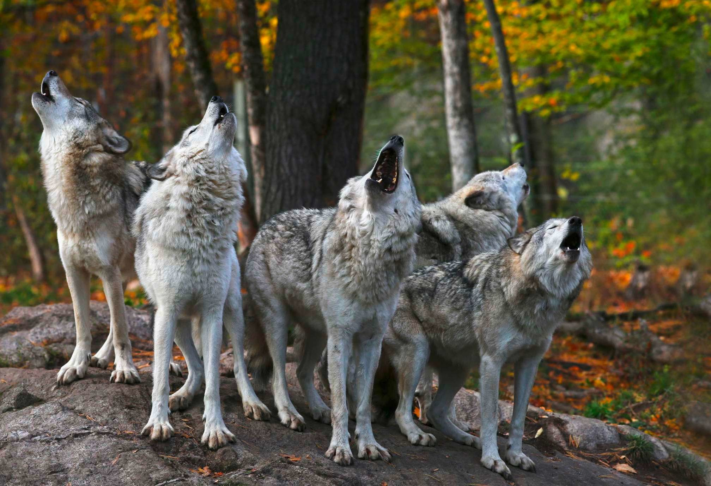

# About me 

This GitHub repository was created to present myself, to put at disposal of everyone my training completions, the awards I received, my certificates, diplomas and my work certificates.

**What I want you know about me ...**

I believe I will bring these 3 top strengths 

1. The never-give up attitude … until success or failure, but don’t stay in an unaccomplished state … this is too frustrating to me! I Keep focused on the goal(s).

1. I generally think broader than the given scope and like transforming challenges in opportunities.

1. I tend to optimize as much as possible, but my motto remains still “Keep It Simple!”.

The animal that is symbolic of these areas is ...

**The ant**. They do each, by specialization, a simple activity but all together, they build and maintain very complex organization. Ants are pure team players !

**I believe that important areas for me are ...**

1. take distance from day-to-day technical work and act more strategically.

1. leverage current technical knowledge and customer operations skills.

The animal that is symbolic of these areas is ...

**The wolf** – autonomous ...

but also unbeatable when playing in team!

